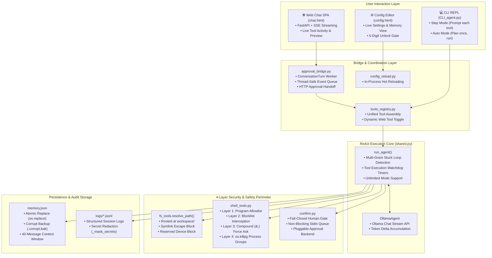

<div align="center">

# MSA AI Agent
### Sandboxed Autonomous AI Coding Agent & Web Platform

[](https://www.python.org/)
[](https://fastapi.tiangolo.com/)
[](https://ollama.com/)
[](https://docs.astral.sh/uv/)
[-22c55e?style=for-the-badge&logo=pytest&logoColor=white)](doc/test_report.md)
[](doc/USER_MANUAL.md)

**A production-grade, secure, multi-modal AI coding agent built from scratch on Ollama native tool-calling.**  
Featuring a 4-layer defense-in-depth sandbox, dual interfaces (CLI REPL + Real-time Streaming Web Chat), durable cross-session memory, hosted web search, in-process settings hot-reloading, and an interactive architecture visualizer.

[Quick Start](#quick-start) • [Architecture](#architecture--data-flow) • [Features](#core-features) • [Tool Suite](#tool-suite-reference) • [Configuration](#configuration-reference) • [Testing](#testing--quality-assurance) • [Documentation](#documentation-index)

</div>

---

## Core Features

**MSA AI Agent** is an autonomous developer assistant designed to solve coding tasks, analyze codebases, run shell commands, inspect files, and generate reports within a strictly isolated environment.

- 🛡️ **Zero Host Compromise**: Sandboxed filesystem operations strictly confined to `workspace/` (`fs_tools.py`), combined with a 4-layer shell execution gate (`shell_tools.py`) that catches malicious operator chaining (`&&`, `||`, `;`), command substitution, and process leaks.
- ⚡ **Dual Interaction Surfaces**:
  - **CLI REPL (`CLI_agent.py`)**: Terminal workflow with interactive step mode and plan-once auto mode.
  - **Web SPA (`BE/app/static/chat.html`)**: Real-time Server-Sent Events (SSE) streaming chat, live activity inspector, and sandboxed HTML preview tab.
- 🧠 **Durable Memory Store**: Cross-session persistent JSON memory (`memory.py`) featuring atomic disk writes (`os.replace`), corrupt backup preservation, similarity search, and automated token analytics.
- 🌐 **Config-Gated Web Search & Fetch**: Internet research capabilities via Ollama's hosted search API (`web_tools.py`) with zero local SSRF exposure and strict credential isolation.
- 🎛️ **Live Config & Memory Dashboard**: Web-based configuration management (`BE/app/static/config.html`) with in-process hot-reloading, a 5-digit unlock confirmation gate, directory browser picker, and model spec inspector.
- 📊 **Comprehensive Architecture Visualizer**: 12 standalone interactive SVG diagrams and dependency maps (`code_flow_diagrams/`).
- 🧪 **100% Test Coverage**: **526 tests passed** across 22 test modules (448 Agent Core + 78 Backend API).

---

## Quick Start

Dependencies are managed by [uv](https://docs.astral.sh/uv/) — one root `pyproject.toml` and `uv.lock` reproducing an identical, isolated environment across Linux, macOS, Windows, and WSL.

### 1. Installation & Environment Setup

```bash
# Clone the repository
git clone https://github.com/mohamed-soubhi/MSA_AI_agent.git
cd MSA_AI_agent

# Install uv (if not already installed)
curl -LsSf https://astral.sh/uv/install.sh | sh   # Linux/macOS/WSL
# or on Windows PowerShell:
# powershell -ExecutionPolicy ByPass -c "irm https://astral.sh/uv/install.ps1 | iex"

# Sync dependencies and create isolated virtualenv
uv sync --group dev
```

### 2. Launching the Web Backend & UI

Launch the FastAPI backend service with live auto-reload:

```bash
# Linux / macOS / WSL
./run_be.sh

# Windows
run_be.bat
```

Open your browser to:
- 💬 **Web Chat & Activity Inspector**: [http://localhost:8000/chat](http://localhost:8000/chat)
- ⚙️ **Interactive Config Editor**: [http://localhost:8000/config](http://localhost:8000/config)
- 📊 **Architecture Visualizer**: Open [`code_flow_diagrams/index.html`](code_flow_diagrams/index.html) in your browser.
- 🩺 **Health Liveness API**: [http://localhost:8000/health](http://localhost:8000/health)

### 3. Launching the CLI Agent

Launch the terminal REPL agent:

```bash
# Linux / macOS / WSL
./run_cli_agent.sh

# Windows
run_cli_agent.bat

# Or run directly via uv:
uv run agent/CLI_agent.py
```

---

## Architecture & Data Flow



---

## Tool Suite Reference

The agent has access to **11 specialized tools** assembled through `tools_registry.py`, ensuring zero drift between CLI and Web interfaces:

| Category | Tool | Function Signature | Safety & Isolation Invariants |
|---|---|---|---|
| **Filesystem** | `list_directory` | `list_directory(path=".")` | Read-only. Sandboxed to `workspace/`. Rejects directory traversal (`../`). |
| **Filesystem** | `read_file` | `read_file(path)` | Read-only. Strictly confined to sandbox root. Normalizes paths via NFKC. |
| **Filesystem** | `write_file` | `write_file(path, content)` | Gated by `confirm()`. Atomic write inside `workspace/`. Blocks path escapes. |
| **Filesystem** | `create_directory` | `create_directory(path)` | Gated by `confirm()`. Creates parent directories safely inside sandbox. |
| **Terminal** | `run_command` | `run_command(command)` | 4-layer security gate: allowlist, blocklist, compound operator check, `os.killpg` group isolation. |
| **Human-in-Loop** | `ask_human` | `ask_human(question)` | Conversational HITL prompt. Pauses execution until user answers. |
| **Human-in-Loop** | `ask_human_choice` | `ask_human_choice(question, options)` | Presents numbered choices. Validates selection range and reprompts on error. |
| **Memory** | `remember_fact` | `remember_fact(fact, tags=None)` | Writes durable fact to `memory.json` with timestamp and tags via atomic file swap. |
| **Memory** | `recall_memory` | `recall_memory(query)` | Scans cross-session facts and summaries using keyword and tag matching. |
| **Web (Config-Gated)** | `web_search` | `web_search(query, max_results=5)` | Proxied via Ollama hosted search. Gated by `confirm()`. Truncates output snippets. |
| **Web (Config-Gated)** | `web_fetch` | `web_fetch(url)` | Fetches web page content. Verifies HTTP/HTTPS scheme. Truncates at character ceiling. |

---

## Project Structure

```
MSA_AI_agent/
├── agent/                       # Core Agent Engine
│   ├── CLI_agent.py             # Main CLI orchestrator (REPL loop & auto mode)
│   ├── shared.py                # ReAct loop, OllamaAgent wrapper, stuck-loop detection
│   ├── tools_registry.py        # Central tool registry (CLI & BE shared)
│   ├── fs_tools.py              # Sandboxed filesystem CRUD operations
│   ├── shell_tools.py           # 4-layer command execution gate & process management
│   ├── web_tools.py             # Hosted web search & web fetch integration
│   ├── confirm.py               # Fail-closed human confirmation gate & non-blocking I/O
│   ├── agent_mode.py            # Global AUTO_MODE state switch
│   ├── auto_runner.py           # Plan generation & autonomous execution
│   ├── human_tools.py           # Conversational HITL tools (ask_human, choice)
│   ├── memory.py                # Cross-session durable memory & token accounting
│   ├── chat_logger.py           # Structured JSONL session logging & secret masking
│   ├── log_config.py            # Logging configuration switches
│   ├── agent_config.py          # Central configuration & type-safe env parser
│   └── config_reload.py         # In-process settings hot-reloading coordinator
├── BE/                          # FastAPI Backend & Web Services
│   ├── app/
│   │   ├── main.py              # FastAPI application factory & lifespan
│   │   ├── api/                 # Endpoints: chat, config, models, health, memory, workspace, shutdown
│   │   ├── core/                # approval_bridge, agent_bridge, tool_bridge, config_schema
│   │   └── static/              # Web SPA: chat.html (with Activity & Preview), config.html
│   ├── nginx/                   # nginx.conf local-dev reverse proxy template
│   └── tests/                   # Backend pytest suite (78 tests)
├── workspace/                   # Isolated agent sandbox root (BASE_DIR)
├── tests/                       # Agent core pytest suite (446 tests)
├── doc/                         # Comprehensive documentation & audit reports
├── code_flow_diagrams/          # Interactive architecture visualizer & 12 SVGs
├── jsonl-viewer/                # Standalone session log JSONL viewer
├── markdown-reader/             # Standalone Markdown file reader
├── memory.json                  # Durable persistent memory file
├── pyproject.toml               # Unified uv project configuration
└── uv.lock                      # Deterministic dependency lockfile
```

---

## Configuration Reference

Settings can be customized via `.env` files or modified live in the [Config Editor](http://localhost:8000/config):

| Setting | Environment Variable | Default | Description |
|---|---|---|---|
| **Model** | `WORKSHOP_MODEL` | `"glm-5.2:cloud"` | Ollama model identifier (local or cloud). |
| **Sandbox Root** | `WORKSPACE_DIR` | `<root>/workspace` | Absolute path to agent filesystem sandbox. |
| **Unlimited Mode** | `UNLIMITED_MODE` | `false` | Disables time and trial limits for long-running workflows. |
| **Max Iterations** | `MAX_ITERATIONS` | `40` | Maximum ReAct tool-calling rounds per prompt. |
| **Tool Timeout** | `TOOL_TIMEOUT_SECONDS` | `30` | Execution time limit per tool invocation. |
| **Confirm Timeout** | `CONFIRM_TIMEOUT_SECONDS` | `120` | Maximum time allowed for human approval before fail-closed. |
| **Shell Timeout** | `SHELL_TIMEOUT_SECONDS` | `30` | Timeout for shell command subprocesses before SIGKILL. |
| **Web Tools Enabled** | `WEB_TOOLS_ENABLED` | `false` | Toggles availability of `web_search` and `web_fetch`. |
| **Web Confirm** | `WEB_TOOLS_REQUIRE_CONFIRMATION` | `true` | Requires human confirmation before internet queries. |
| **Memory Enabled** | `MEMORY_ENABLED` | `true` | Cross-session memory persistence toggle. |
| **Echo Logging** | `LOG_ECHO_TO_TERMINAL` | `true` | Echoes structured JSONL event records to terminal stdout. |

---

## Testing & Quality Assurance

The codebase includes a comprehensive, automated test suite with **100% pass rate**:

```bash
# Run the core agent test suite (446 tests)
uv run pytest tests/ -v

# Run the backend API test suite (78 tests)
uv run --group dev --directory BE pytest tests/ -v

# Run full project test suite with coverage report
uv run pytest tests/ --cov=agent --cov-report=term-missing

# Generate Markdown test report (doc/test_report.md)
uv run python3 tests/generate_report.py
```

### Test Suite Metrics:

- **Agent Core Suite:** 448 Passed (13 modules: CLI, Config, AutoRunner, Logger, Reload, Confirm, FS, Human, Memory, Shared, Shell, Web)
- **Backend API Suite:** 78 Passed (9 modules: ApprovalBridge, ToolBridge, Chat, Config, Health, MemoryAPI, Models, Shutdown, Workspace)
- **Total Repository Health:** **526 / 526 Passed (100%)**

---

## Documentation Index

| Document | Purpose |
|---|---|
| **[doc/USER_MANUAL.md](doc/USER_MANUAL.md)** | Practical user manual: running CLI, web UI, uv commands, and troubleshooting. |
| **[doc/README.md](doc/README.md)** | Complete module reference and documentation sitemap. |
| **[doc/BE.md](doc/BE.md)** | Backend service architecture, SSE streaming, and REST API reference. |
| **[doc/web_tools.md](doc/web_tools.md)** | Hosted web search and web fetch tool reference. |
| **[doc/code_review_report.md](doc/code_review_report.md)** | Architectural audit and defect assessment report. |
| **[doc/code_review_report.html](doc/code_review_report.html)** | Interactive HTML code review dashboard. |
| **[doc/test_report.md](doc/test_report.md)** | Automated test execution report with individual test IDs. |
| **[code_flow_diagrams/index.html](code_flow_diagrams/index.html)** | Standalone interactive system visualizer & 12 SVG flowcharts. |

---

## License & Attribution

Developed with ❤️ as an advanced agentic coding workshop project. Released under the MIT License.
